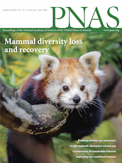

## Hi 👋 
## I turn complex data 🤖 and science 🦖 into immersive and engaging narratives that everyone can enjoy 🤓

Right now, I do a lot of research on Virtual Reality (VR) and Augmented Reality (AR) and whether people learn better through these technologies than they do through traditional museum displays. This [article](https://www.aam-us.org/2020/06/15/towards-frictionless-augmented-reality/) summarizes my thoughts on how we can make AR more accesible for museum patrons. Besides this research, I also curate immersive museum exhibitions like [*L.A. Underwater*](https://nhm.org/la-underwater) that use art to help people understand science. 

# Research

               

Find my award winning research publications on [Google Scholar](https://scholar.google.com/citations?user=hx6r5z0AAAAJ&hl=en&oi=ao). My papers are in the top 5th percentile of research tracked by Altmetric. Some, like my cover articles for [*Ecology and Evolution*](https://doi.org/10.1002/ece3.2054) and [*PNAS*](https://doi.org/10.1073/pnas.1804906115), are within the most discussed 1% of articles in their respective journals. Check out [*The New York Times*](https://www.nytimes.com/2016/02/04/science/explorers-club-mammoth-dinner.html?rref=collection/sectioncollection/science&action=click&contentCollection=science&region=rank&module=package&version=highlights&contentPlacement=1&pgtype=sectionfront&_r=0), [*The Atlantic*](https://www.theatlantic.com/science/archive/2018/10/mammals-will-need-millions-years-recover-us/573031/), [*Popular Science*](https://www.popsci.com/story/animals/escobars-invasive-hippos/), or [BBC](https://www.bbc.co.uk/newsround/60618249) for a sampling of the kind of press coverage my research usually gets. The code for any paper where I am the lead author is publicly archived with that paper's Supplemental Information under a DOI like this: [doi.org/10.5281/zenodo.1286876](doi.org/10.5281/zenodo.1286876).

### Are you looking for a virtual Ice Age friend? 

Try out these Snapcodes of AR fossil animals I helped build or check out even more [freely downloadable models](https://skfb.ly/osVxM). Read [this  academic paper](https://doi.org/10.26879/1191) or [this invited article](https://sketchfab.com/blogs/community/forging-a-3d-paleoart-pipeline-with-sketchfab/) if you want to learn more about the science, tech, and art behind these AR models. 

 
-----------------------

### Are you looking for phylogenetic analysis software that can incorporate continuous probabilities of species occurence?

You should try out [`mallorn`](https://github.com/MegaPast2Future/mallorn), my R package for calculating phylogenetic diversity metrics I developed such as expected evolutionary distinctiveness (expected ED):

While it was designed for biological research, [`mallorn`](https://github.com/MegaPast2Future/mallorn) should technically work on any kind of hierarchical clustering dendrogram to probabilistically assign edge lengths to tips ...as long as the cophenetic distance between tips has real world meaning. Find more details in the [Supplement](https://www.pnas.org/content/pnas/suppl/2018/10/09/1804906115.DCSupplemental/pnas.1804906115.sapp.pdf) to [this paper](https://www.pnas.org/content/115/44/11262). 

-----------------------

### Need to incorporate categorical or ordinal data into quantitative distance matrices for clustering or ordination? 

Read my suggestions and warnings in this [paper](https://www.biorxiv.org/content/10.1101/2021.11.02.466687v1) first. (It also has a handy table of all the different ways you can calculate Gower's distance on ordinal data in R)

-----------------------

### Are you looking for the largest database of phylogenies, ranges, and functional traits for mammals?

You should check out the latest stable version of [PHYLACINE](https://github.com/MegaPast2Future/PHYLACINE_1.2/): The Phylogenetic Atlas of Mammal Macroecology.

-----------------------

### Are you looking for functional traits for all large-bodied, terrestrial, avian and mammalian herbivores that lived during the last 130,000 years?

You should check out the latest stable version of [HerbiTraits](https://github.com/MegaPast2Future/HerbiTraits), a database led by my former PhD students.

 

<!--
**ursus-americanus/ursus-americanus** is a ✨ _special_ ✨ repository because its `README.md` (this file) appears on your GitHub profile.

Here are some ideas to get you started:

- 🔭 I’m currently working on ...
- 🌱 I’m currently learning ...
- 👯 I’m looking to collaborate on ...
- 🤔 I’m looking for help with ...
- 💬 Ask me about ...
- 📫 How to reach me: ...
- 😄 Pronouns: ...
- ⚡ Fun fact: ...
-->
