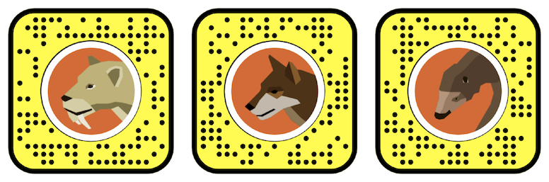
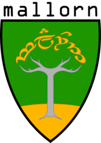

## Hi 👋 
## I turn complex data 🤖 and science 🦖 into immersive and engaging narratives that everyone can enjoy 🤓

Right now, I do a lot of research on Virtual Reality (VR) and Augmented Reality (AR) and whether people learn better through these technologies than traditional museum displays. This [article](https://www.aam-us.org/2020/06/15/towards-frictionless-augmented-reality/) summarizes my thoughts on how we can make AR more accesible for museum patrons.

# Research
Find my research publications on [Google Scholar](https://scholar.google.com/citations?user=hx6r5z0AAAAJ&hl=en&oi=ao). 

#### Are you looking for a virtual Ice Age friend? 

Try out these Snapcodes of virtual Pleistocene animals I helped make. 

 
-----------------------

#### Are you looking for phylogenetic analysis software that can incorporate continuous probabilities of species occurence?

You should try out [`mallorn`](https://github.com/MegaPast2Future/mallorn), my R package for calculating phylogenetic diversity metrics.

-----------------------

#### Are you looking the largest database of phylogenies, ranges, and functional traits for mammals?

You should check out the latest stable version of [PHYLACINE](https://github.com/MegaPast2Future/PHYLACINE_1.2/): The Phylogenetic Atlas of Mammal Macroecology.

-----------------------

#### Are you looking for functional traits for all large-bodied, terrestrial, avian and mammalian herbivores that lived during the last 130,000 years?

You should check out the latest stable version of [HerbiTraits](https://github.com/MegaPast2Future/HerbiTraits), a database lead by my former PhD students.

 

<!--
**ursus-americanus/ursus-americanus** is a ✨ _special_ ✨ repository because its `README.md` (this file) appears on your GitHub profile.

Here are some ideas to get you started:

- 🔭 I’m currently working on ...
- 🌱 I’m currently learning ...
- 👯 I’m looking to collaborate on ...
- 🤔 I’m looking for help with ...
- 💬 Ask me about ...
- 📫 How to reach me: ...
- 😄 Pronouns: ...
- ⚡ Fun fact: ...
-->
